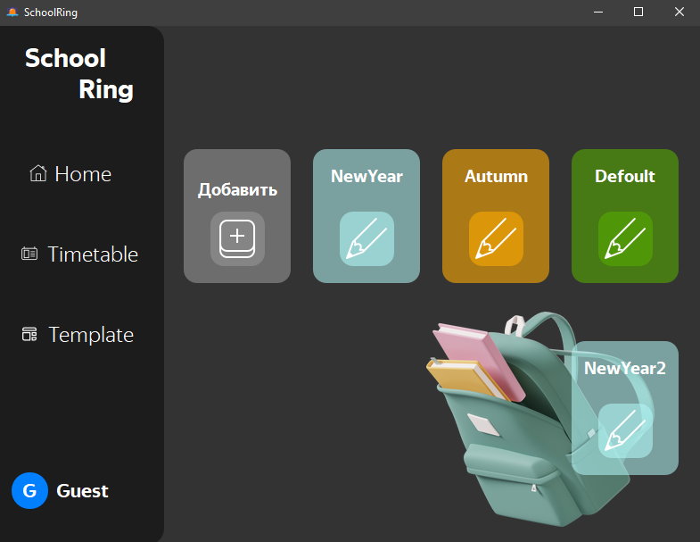

# SchoolRing
## Аторы

> Гришин Антон  
>GitHub: [https://github.com/Anthropophag](https://github.com/Anthropophag)  
>Telegram: [https://t.me/anton_ingrish](https://t.me/anton_ingrish)

## Идея проекта

Цель проекта — создать программу по управлению системой звонков в школе. Она позволит устанавливать любую музыку, быстро настраивать расписание, автоматически воспроизводить звонки по выбраному расспсанию. А также создавать собственные шаблоны, и использывать в любых ситуациях.  
Сейчас я представляю только первую версию этого проекта в дальнейшем он будет активно развиваться. Впереди ещё много полезного функционала и классного дизайна

## О программе

В программе существует 2 типа пользователей: гость и администратор. Администратору доступные все функции программы, включая редактирование данных. Гость же может только просматривать содержание.

Программа предоставляет следующий функционал:

- Внесение, изменение расписания
- Создание тематических шаблонов звонков

Слева находится меню по которому можно быстро попасть в любую вклаку. Существует 3 вкладки:

- Home
- Timetable
- Template

## Технологии

Основным и единственным языком является **Python версии 3.10**. Для воплощения в реальность всех идей потребовались следующие технологии. Для создания графического интерфейса — **PyQt6**. Для автоматического воспроизведения звонков — модуль **threading** из стандартной библиотеки Python, для работы с многопоточность. Работа с расписанием осуществлялась библиотекой **schedule**. С осталными бибоиотеками и их версиямии можно онзанкомиться в файле [requirements.txt](/requirements.txt). 

## Реализация

При проектированиии архитектуры проекта старался следовать классическим пттерным (таким как MVC), принцыпами S.O.L.I.D, Банды четырёх, и др. Структура разбита на клосическе блоки:

Первое — логические блоки для в которые я постарался перенести все техническе процессы, они представлены файлми [data_ceking.py](/data_ceking.py), [base_of_data.py](/base_of_data.py), [services.py](/services.py). 

Второе — блок взаимдействия с пользователем, в нем все чот относится к интерфейсу программы, получению и выводу данных. Представлен запускаемым файлом [views.py](/views.py).

Программа состоит из нескольких классов, кторы взаимодействуют друг с другом. Главный класс — это класс `Window` который на прямую или косвенно обращается к другим классам. Есть класс `DataBaseManager` экземпляры которого могут создаваться в других классах и “брать на себя” всё управление базой даных. С отстальными классами можно ознакомится в [ТЗ](technical_specification.md).
