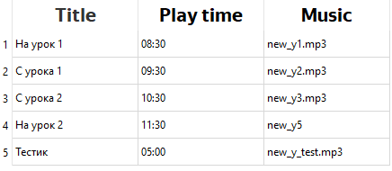

# 1. Цель проекта

Цель проекта — разработать программу для удобного управления системой звонков в школе. В которой будет возможность  создавать тематические шаблоны звонков на день/неделю. Добавлять и оперативно редактировать расписание уроков. Это первая версия проекта, я бы даже сказал beta, в дальнейшем буду его активно развивать.

---

# 2. Описание системы

Система состоит из следующих основных функциональных блоков:

1. Типы пользователей
2. Регистрация и авторизация
3. Функционал для администратора
4. Функционал для гостя

---

## 2.1 Типы пользователей

Система предусматривает два типа пользователей: 

- администратор
- гость

Администратору доступно вносить какие либо изменения в систему и начинать эфиры. Гость же может только просматривать информацию. 

---

## 2.2 Регистрация авторизация

При регистрации у пользователя запрашивается:

- номер телефона
- ФИО
- номер школы
- номер здания

Пользователь создаёт:

- логин
- пароль

---

## 2.3 Функционал администратора

### 2.3.1 Домашняя страница

Во вкладке **Home**, в верху окна пользователь видит статус ближайшего звонка, например: Через 5 мин прозвенит звонок — Sizor, Нечего ждать

Ниже доски с расписанеим на каждый день этой недели.

---

### 2.3.2 Редактирование рассписания уроков

Администратору будет доступно создание и редактирование рассписания уроков во вкладке **Timetable**. В этой же вкладке устанавливается шаблон на кажый учебный день/неделю. Будет одно стандартное расписание которое будет по умолчанию проигрываться каждый день. В Timtable вносятся только особенные дни, напрмимер предпраздничные

---

### 2.3.3 Создание шаблонов звонков

Во вкладке **Template** администратор создаёт шаблон звонков на день. По нажатию кнопки Create, открывается окно с таблицей, за основу которой моно взять один из созданных шаблонов и подредактировать детали. Можно создать новый шаблон, если это может понадобится в будещем.  

В таблице присутсвуют 3 поля: title,  play_time,  music.

Пример такой таблицы:

---

## 2.4 Функционал для гостя

Гость может просматривать: всю информацию на домашней странице, список шаблонв и их содержание, расписание уроков. Для внесения изменений требуется ввести логин и пароль администратора

---

# З. Cтек технологий

Для реализации системы исопльзуется следующий стек технлогий:

- Язык Python версии 3.10
    
    Основной язык проекта.
    
- Библиотека PyQt6
    
    Для создания графического интерфейса
    
- QML
    
    Язык для настройки графического интерфейса в PyQt
    
- модуль Auioplayer
    
    Служит олной цели — воспроизведение мелодии
    
- модуль Threading
    
    Позволяет работать с многопаточностью в Python, используется для реализации одновременных процессов в программе. К ним относится работа оконного приложения для взаимодействия с пользователем и постоянное отслеживание времени, для восрпоизвдения звонков
    
- библиотека Schedule
    
    Позволяет удобно работать с рассписанием
    
- SQLite
    
    Основня база данных  этом проекте
    
- модуль time
- модуль datetime

---

# 4. Требования к дизайну

Минимализм, локаничность, функциональность, интуитивность. Тёмный фон. Меню всегда открыто с левой стороны окна, в нём:

- Вкладки
- Профиль
- Названеи продукта/логотип

---

# 5. Реализация

При проектированиии архитектуры проекта старался следовать классическим пттерным (таким как MVC), принцыпами S.O.L.I.D, Банды четырёх, и др. Структура разбита на клосическе блоки:

Первое — логические блоки для в которые я постарался перенести все техническе процессы, они представлены файлми **data_ceking.py**, **base_of_data.py**, **services.py**. 

Второе — блок взаимдействия с пользователем, в нем все чот относится к интерфейсу программы, получению и выводу данных. Представлен запускаемым файлом **views.py.**

В программе взаимодействуют следоющие классы:

- `Window` отвечает за оконную программу и взаимодействие с пользователем, ввод и вывод данных. Является запускаемым файлом.
- `LginData` и `RegistrData` оба класса наледоются от NamedTuple и используются для храниения, передачи, введёных пользователем, данных.
- `RingManager` агрегирует данные рассписаня и воспроизведение мелодии
- `LoginChecker` и `RegistrChecker` у каждого из классов есть свойство `is_correct` котрое равно True если данные веднеы коректно и проходят проверку. Или False во всех остальных случаях
- `DataBaseManager` экземпляры этого класса могут создаваться в других классах и “брать на себя” всё управление базой даных